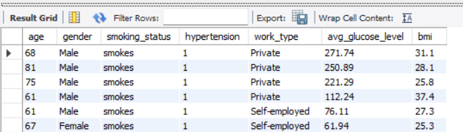

# 🩺 Stroke Risk Analysis Using SQL

A healthcare SQL case study analyzing stroke prevalence, patient demographics, lifestyle risk factors, and hospital operations using MySQL.

This project demonstrates how SQL can transform healthcare data into meaningful business insights through exploratory analysis, relational database techniques, and advanced SQL queries.

---

# 📸 Sample Analysis

### Stroke Prevalence by Smoking Status


### High-Risk Patient Identification



---

# 📖 Project Overview

This project analyzes a healthcare dataset containing **5,110 patient records** to identify demographic, clinical, and lifestyle factors associated with stroke occurrence.

The project answers real-world healthcare business questions using SQL and demonstrates techniques commonly used in Healthcare Analytics, Business Intelligence, and Health Informatics.

---

# 🎯 Project Objectives

- Analyze overall stroke prevalence
- Identify high-risk patient groups
- Evaluate age and gender trends
- Assess the impact of smoking behavior
- Analyze blood glucose patterns
- Demonstrate relational database analysis using SQL
- Apply advanced SQL techniques to solve healthcare business problems

---

# 🛠️ Technologies Used

- MySQL
- MySQL Workbench
- Microsoft Excel
- SQL

---

# 💻 SQL Skills Demonstrated

### Basic SQL

- SELECT
- WHERE
- ORDER BY
- LIMIT
- DISTINCT

### Data Aggregation

- COUNT()
- SUM()
- AVG()
- MIN()
- MAX()
- GROUP BY
- HAVING

### Conditional Logic

- CASE WHEN

### Joins

- INNER JOIN
- LEFT JOIN

### Advanced SQL

- Subqueries
- Correlated Subqueries
- Common Table Expressions (CTEs)
- Window Functions (RANK)

---

# 📊 Business Questions Answered

- How many patients experienced a stroke?
- What is the overall stroke prevalence?
- Which age groups have the highest stroke risk?
- Does stroke prevalence differ by gender?
- What is the average blood glucose level among stroke patients?
- Which smoking groups show the highest stroke prevalence?
- Which patients belong to high-risk cohorts?
- How are stroke cases distributed across hospitals?
- Which patients are above their hospital's average age?

---

# 🔍 Key Findings

- The dataset contains **5,110** patient records.
- Overall stroke prevalence is **4.87%**.
- Patients aged **above 70 years** have the highest stroke prevalence.
- Male patients show a slightly higher stroke prevalence than females.
- Stroke patients have an average blood glucose level of **132.54 mg/dL**.
- Former smokers exhibit the highest stroke prevalence among smoking categories.
- High-risk patient cohorts can be identified by combining age, smoking history, BMI, hypertension, and blood glucose levels.

---

# 💼 Business Value

This analysis demonstrates how SQL can support:

- Population health analytics
- Preventive healthcare planning
- Hospital reporting
- Risk stratification
- Resource allocation
- Clinical decision support

---

# 📂 Repository Structure

```
stroke-risk-analysis-sql/
│
├── data/
│   └── Stroke_Data_SQL.xlsx
│
├── images/
│   ├── Stroke prevalence_&_smoking_relation.png
│   └── high-risk_patients.png
│
├── sql/
│   └── case_study_stroke_data.sql
│
└── README.md
```

---

# 🚀 Future Enhancements

- Develop an interactive Power BI dashboard using SQL outputs
- Integrate additional clinical variables
- Perform predictive stroke risk modeling using Python
- Connect SQL queries to healthcare BI dashboards

---

# 👩‍💻 Author

**Varsha**

Healthcare Data Analyst | Health Informatics
